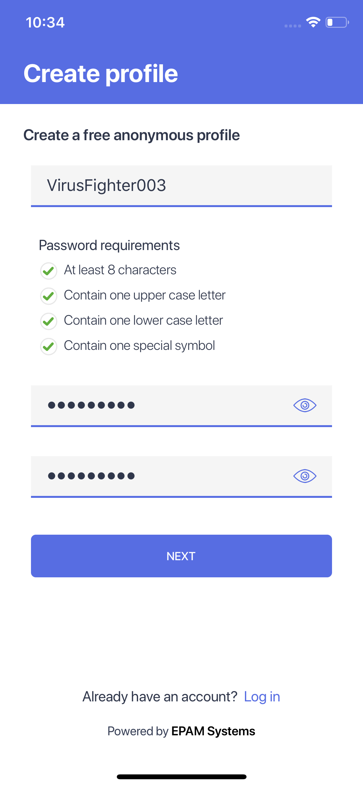
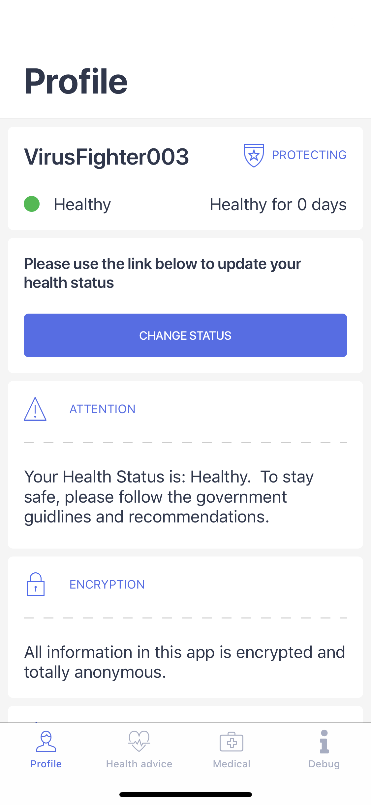

# Covid Resistance mobile application

Xamarin.Forms mobile application that will help users to stay safe during coronavirus outbreak by tracking contacts with other users through Bluetooth.

## [Screenshots](docs/screenshots.md)

[Show more](docs/screenshots.md)

## Supported platforms

* Android 5.0+ (API level 21)
* iOS 10.0+

## Supported features

* Integration with [back-end](docs/getting_started.md).
* Anonymous account creation and log into existing one.
* Supports push notifications throe Azure NotificationHub.
* Ability to use chat-bot to gain actual information.

# Getting started
[Follow instructions on the getting started guide](docs/getting_started.md)

## External dependencies

* [Xamarin.Forms](https://www.xamarin.com/forms)
* [Xamarin.Essentials](https://www.github.com/xamarin/essentials)
* [LiteDB](https://github.com/mbdavid/LiteDB)
* [Prism.Forms.Extended + Prism.DryIoc.Extensions](https://prismlibrary.com/)
* [Nito.AsyncEx](https://github.com/StephenCleary/AsyncEx)
* [ReactiveUI.XamForms](https://github.com/reactiveui/reactiveui)
* [Xamarin.FFImageLoading.Forms + Xamarin.FFImageLoading.Svg.Forms](https://github.com/luberda-molinet/FFImageLoading)
* [PropertyChanged.Fody](https://github.com/Fody/PropertyChanged)
* [Newtonsoft.Json](https://www.newtonsoft.com/)
* [FluentValidation](https://github.com/JeremySkinner/FluentValidation)
* [StyleCop.Analyzers](https://github.com/DotNetAnalyzers/StyleCopAnalyzers)
* [Microsoft.Rest.ClientRuntime](https://www.nuget.org/packages/Microsoft.Rest.ClientRuntime/)
* [Mobile.BuildTools + Mobile.BuildTools.Configuration](https://github.com/dansiegel/Mobile.BuildTools)
* [Microsoft.AppCenter.Analytics + Microsoft.AppCenter.Crashes](https://appcenter.ms)
* [Microsoft.Extensions.Logging + Microsoft.Extensions.Logging.Debug](https://www.nuget.org/packages/Microsoft.Extensions.Logging/)
* [Xamarin.Azure.NotificationHubs.iOS + Xamarin.Azure.NotificationHubs.Android](https://docs.microsoft.com/en-us/xamarin/xamarin-forms/data-cloud/azure-services/azure-notification-hub)

## Solution Structure

* **Covi** - Xamarin.Forms crossplatform library. Contains application pages and several modules implementations.
* **Covi.Android** - Android application. Apart from application implementation contains Bluetooth platform specific code.
* **Covi.iOS** - iOS application. Apart from application implementation contains Bluetooth platform specific code.
* [**Covi.Client**](docs/covi_client.md) - .NET Standart 2.0 library to interact with specified backend.
* [**Covi.Configuration**](docs/covi_configuration.md) - .NET Standart 2.0 library which contains application constants and configuration.

## License Information

Licensed under Apache 2.0, [LICENSE](LICENSE)
