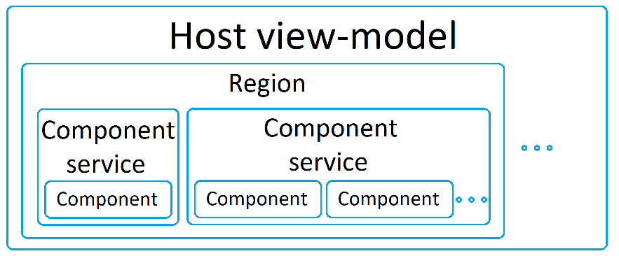
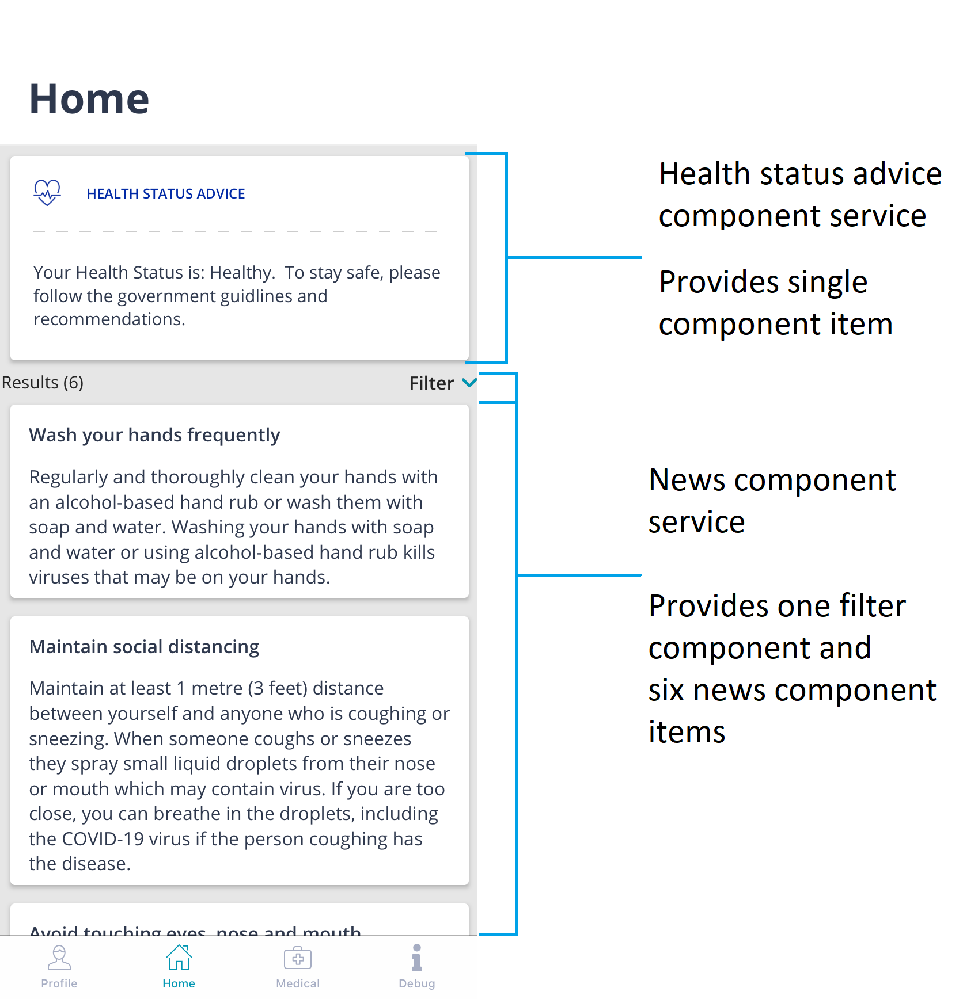

# Components modularity

## About
Main purpose of the modular approach is to make the reuse of the existing controls on the other pages of the application as simple as possible. Moreover implementation of the new components became simpler.

## Infrastructure

**Host view-model** - view-model which usually represents separate page of the application with its own page lifecycle. In the end it is expected that the user will see on this page one or several components. Such view model must be derived from the class [`CompositeViewModelBase`](../../../src/Covi/Features/!Base/CompositeViewModelBase.cs).

**Region** - space which role is to aggregate components with different functionality into the one collection of components. It is represented by the [`RegionManager`](../../../src/Covi/Features/!Base/Regions/RegionManager.cs) class.

**Component service** - service which role is to provide region with the actual collection of the components. Such service must implement interface [`IComponentService`](../../../src/Covi/Features/!Base/ComponentsManagement/IComponentService.cs); also there are two basic implementations: [`StatelessComponentServiceBase`](../../../src/Covi/Features/!Base/ComponentsManagement/StatelessComponentServiceBase.cs) and [`StatefulComponentServiceBase<TState>`](../../../src/Covi/Features/!Base/ComponentsManagement/StatefulComponentServiceBase.cs).

**Component** - view-model and/or corresponding view with simple (singular or atomic) purpose, e.g. representing specific news article preview or displaying short user profile information. Component must implement the [`IComponent`](../../../src/Covi/Features/!Base/IComponent.cs) interface; in majority of cases it should be derived from the [`ComponentViewModelBase`](../../../src/Covi/Features/!Base/ComponentViewModelBase.cs).

**Host context** - class and object which aggregates several view-model related items ([`HostContext`](../../../src/Covi/Features/!Base/HostContext.cs)). Lifecycle events and subscriptions are handled by the `ActivatorManager` property, navigation can be accessed by the `NavigationService` property and component management is handled by the `ComponentsManager`.

## Table of characteristics

|          | Host view-model | Region | Component service | Component |
|----------|-----------------|--------|-------------------|-----------|
|Represented on the **model** side by |Specific implementation of the `CompositeViewModelBase` |Instance of the `RegionManager` class |Implementation of the `IComponentService` interface |Implementation of the `IComponent` interface |
|Represented on the **view** side by |Usually page of the application (e.g. specific `ContentPage` implementation) |`ComponentsHost` - view derived from the `CollectionView` which has **RegionManager** bindable property |Not present on UI |Required `View` implementation for the component |
|Identified by |Not affected by modular approach |`string RegionIdentifier { get; }` property: **Component services** are registered to the redion with the same string identifier |`string ComponentKey { get; }` property which should have the same name as the **Component service** derived class |Has no identifier of its own; group affinity is defined by the `string ComponentGroupKey { get; }` property which is initialized upon component attachment  |
|Contains |Can contain from **0 to N regions**, although usually there is no need to have more than one region per one host view-model |Can contain from **0 to N component services** |Contains collection of components with any number **(from 0 to N) components** |Usually no child items |
|When to implement |Not affected by modular approach |`RegionManager` is not supposed to be derived from, no implementation needed |There is a need to create a new **Component** or group of **Components** with similar purpose |There is a need to either implement new visual component or to enrich the existing **Component service** |
|Mutability |Has strictly defined amount of `RegionManager` properties which should not be recreated or tampered with in any way |`RegionManager` has defined (at the module registration stage) number of **Component services**. This collection of **Component services** is immutable |`IComponentService` interface property `IObservable<IComponentsGroup> Items { get; }` implementation allows to change the collection of components `IComponentsGroup` by sending new observable sequence values.  |Depending on the component purpose can change its own content but not its own presence in the component collection |
|Object creation responsibility |Not affected by modular approach |`RegionManager` instance must be created by the **Host view-model** in the constructor with the help of the fabric method `RegionManager.CreateForIdentifier(string regionIdentifier, HostContext hostContext)`|Instantiated by the resolver at the moment of `RegionManager` initialization |In case of the `StatelessComponentServiceBase` - created by the resolver at the moment of the providing new component items by the **Component service**; in case of the `StatefulComponentServiceBase<TState>` - during `IList<IComponent> UpdateState(TState state)` method execution |

## Visual representation



## Page sample



`HealthStatusAdviceComponentService` is a **stateless component service**: its role is to provide single component.
```cs
public class HealthStatusAdviceComponentService : StatelessComponentServiceBase
{
    public HealthStatusAdviceComponentService(IContainerProvider containerProvider)
        : base(containerProvider)
    {
    }

    public override string ComponentKey { get => nameof(HealthStatusAdviceComponentService); }

    protected override IObservable<IList<Type>> GetComponentTypes()
    {
        return Observable.Return(new List<Type>()
        {
            typeof(HealthStatusAdviceViewModel)
        });
    }
}
```

`NewsComponentService` is a **stateful component service**: components and its contents are dependant on host lifecycle and the content of several components is dynamic. Filter component remains at the top of the components list, then it is followed by the news component items.

```cs
public class NewsComponentService : StatefulComponentServiceBase<NewsState>
{
    private CancellationTokenSource _lifecycleCancellationTokenSource = new CancellationTokenSource();
    private readonly IUserProfileContainer _userProfileContainer;
    private readonly IErrorHandler _errorHandler;
    private readonly IRecommendationsService _recommendationsService;

    public NewsComponentService(
        IUserProfileContainer userProfileContainer,
        IErrorHandler errorHandler,
        IRecommendationsService recommendationsService)
    {
        _userProfileContainer = userProfileContainer;
        _errorHandler = errorHandler;
        _recommendationsService = recommendationsService;
    }

    public override string ComponentKey => nameof(NewsComponentService);

    public CancellationToken LifecycleToken => _lifecycleCancellationTokenSource.Token;

    public CancellationTokenSource LifecycleCancellationTokenSource => _lifecycleCancellationTokenSource;

    protected override IList<IComponent> UpdateState(NewsState state)
    {
        if (state == null)
        {
            return new List<IComponent>();
        }

        var result = new List<IComponent>();

        switch (state.State)
        {
            case NewsContentState.Busy:
                result.Add(new BusyIndicatorViewModel());
                break;
            case NewsContentState.News:
                result.Add(GetFilterViewModel(state));
                result.AddRange(GetNewsItems(state));
                break;
            case NewsContentState.Default:
            case NewsContentState.Error:
                break;
        }

        return result;
    }

    private NewsFilterViewModel GetFilterViewModel(NewsState state)
    {
        var result = new NewsFilterViewModel();
        result.SetInfo(state);
        return result;
    }

    private IList<IComponent> GetNewsItems(NewsState state)
    {
        var result = new List<IComponent>();
        foreach (var newsItem in state.RecommendationsList.Data)
        {
            var viewModel = new RecommendationItemViewModel(newsItem);
            result.Add(viewModel);
        }

        return result;
    }

    protected override async void OnActivated()
    {
        base.OnActivated();
        Interlocked.Exchange(ref _lifecycleCancellationTokenSource, new CancellationTokenSource())?.Dispose();

        try
        {
            var profile = await _userProfileContainer.GetAsync().ConfigureAwait(false);
            var statusId = profile?.StatusId;
            if (statusId != null)
            {
                SetState(NewsState.CreateBusyState());

                var recommendationsList = await _recommendationsService.GetRecommendationsAsync(statusId.Value, LifecycleToken).ConfigureAwait(false);

                SetState(NewsState.CreateNewsState(recommendationsList));
            }
        }
        catch (Exception e)
        {
            await _errorHandler.HandleAsync(e);
            SetState(NewsState.CreateErrorState());
        }
    }

    protected override void OnDeactivated()
    {
        base.OnDeactivated();
        _lifecycleCancellationTokenSource?.Cancel();
    }
}
```

## Registration of the components to the region

```cs
RegionManager.RegisterFunctionalityToTheRegion<HealthStatusAdviceComponentService>(RecommendationsViewModel.HomeRegionIdentifier, DataTemplateProviderFactory.CreatePlainFor<HealthStatusAdviceView>());
RegionManager.RegisterFunctionalityToTheRegion<NewsComponentService>(RecommendationsViewModel.HomeRegionIdentifier, new NewsDataTemplateProvider());
```

Components will occur in the region in the order of their registration.

## Data template providers

Plain data template providers (which should be used in case of stateless and/or primitive component services) can be instantiated by the `DataTemplateProviderFactory.CreatePlainFor()` method. More complex data template providers should be subclassed from the `CompositeDataTemplateProvider` class.
```cs
public class NewsDataTemplateProvider : CompositeDataTemplateProvider
{
    protected override Func<View> GetViewProvider(IComponent component)
    {
        if (component is RecommendationItemViewModel)
        {
            return () => new RecommendationCard();
        }

        if (component is NewsFilterViewModel)
        {
            return () => new NewsFilter();
        }

        return null;
    }
}
```

## Region usage

```xml
<ContentPage
...
    xmlns:components="clr-namespace:Covi.Features.ComponentsManagement" />

<components:ComponentsHost RegionManager="{Binding UserProfileRegion}" />
```

## Additional information

[**Infinite scrolling behaviour**](infinite_scroll.md) - component service supports an ability to contuniously load information